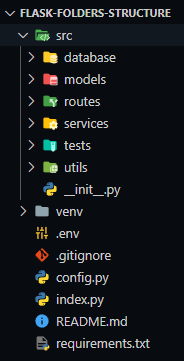
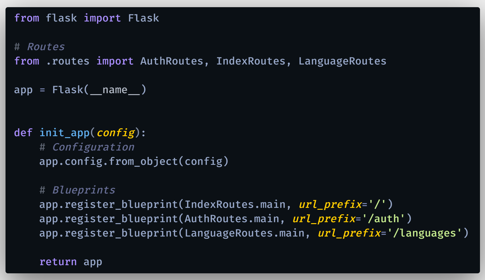

# Python & Flask: Estructura de Carpetas y Archivos

Estructura de proyecto web (RESTful API) de Python y Flask organizado archivos y carpetas de forma ordenada, incluyendo directorios para: routes, models, services, testing y más.

Primero, crear un entorno virtual:
### `python -m virtualenv venv`

Para instalar los paquetes necesarios:
### `pip install -r requirements.txt`

  

